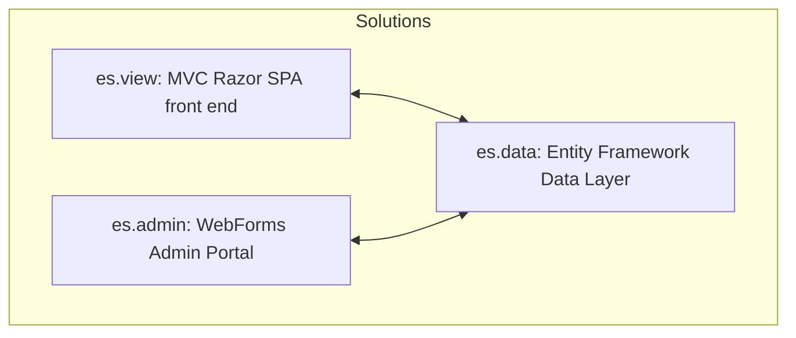
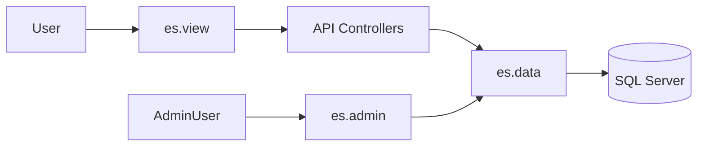

# EchoStream

An end-to-end ASP.NET content-management system: Razor SPA for browsing, WebForms for administration, and a centralized EF data model.

---

## Solutions Overview

### es.view (Front End)
- **Type:** ASP.NET MVC Razor application (.NET Framework 4.7.2)
- **Purpose:** Single-page app for browsing and searching news posts
- **Key components:**
  - **Controllers**: Expose JSON endpoints under `/api` (e.g., `GetPosts`, `GetCategories`)
  - **Views**: Razor (`.cshtml`) templates in \Views folder
  - **Client scripts**: Knockout.js bindings and custom JS in `Scripts/`
  - **Styling**: Bootstrap CSS and Layout in `Content/`
- **Config:** `Web.config` holds two connection strings:
  1. **DefaultConnection** for LocalDB or Azure SQL
  2. **DataEntities** for Entity Framework EDMX model

### es.admin (Admin Portal)
- **Type:** ASP.NET WebForms application (.NET Framework 4.7.2)
- **Purpose:** Manage news content, categories, and media uploads
- **Key components:**
  - **Pages**: CRUD pages under `Pages/` (e.g., `ListPosts.aspx`, `EditPost.aspx`)
  - **Authentication**: Forms authentication via `~/Pages/Login.aspx`
  - **Data access**: Uses the same `DataEntities` EDMX connection
- **Config:** `Web.config` includes `DataEntities` EF connection and auth settings

### es.data (Data Layer)
- **Type:** Class Library (Entity Framework, Database-First)
- **Purpose:** Define data model and repository for EchoStream
- **Key components:**
  - **EDMX model**: Entities such as `Post`, `Category`, `User`
  - **Repositories**: `DataHandlers` namespace implementing CRUD methods
- **Usage:** Referenced by both `es.view` and `es.admin` solutions

## Prerequisites
- [Visual Studio Community 2022](https://visualstudio.microsoft.com/vs/community/) (ASP.NET and web development workloads)
- [Microsoft SQL Express](https://www.microsoft.com/en-us/sql-server/sql-server-downloads) for development (or Azure SQL for production)
- [SQL Server Management Studio (SSMS)](https://learn.microsoft.com/en-us/sql/ssms)
- .NET Framework 4.7.2 SDK
- Entity Framework 6

## Setup & Run

1. **Clone the repo**:
   ```bash
   git clone https://github.com/BenjaminDanker/EchoStream.git
   cd EchoStream
   ```

2. **Open Solutions**:
   - Launch `es.data.sln`, build to generate EF model classes
   - Launch `es.admin.sln` and `es.view.sln`
   - Run ```Update-Package Microsoft.CodeDom.Providers.DotNetCompilerPlatform -r``` in case of error

3. **Configure connection strings** in each `Web.config`:
   ```xml
   <connectionStrings>
     <add name="DefaultConnection"
          connectionString="Data Source=(LocalDb)\MSSQLLocalDB;Initial Catalog=EchoStreamDB;Integrated Security=True"
          providerName="System.Data.SqlClient" />
     <add name="DataEntities"
          connectionString="metadata=res://*/DataModel.csdl|res://*/DataModel.ssdl|res://*/DataModel.msl;provider=System.Data.SqlClient;provider connection string=\"Data Source=(LocalDb)\\MSSQLLocalDB;Initial Catalog=EchoStreamDB;Integrated Security=True;MultipleActiveResultSets=True\""
          providerName="System.Data.EntityClient" />
   </connectionStrings>
   ```

4. **Ensure Database**:
   - Create `EchoStreamDB` in SQL Server
   - Ensure schema matches EDMX (update model if needed using Visual Studio EDMX designer)

5. **Run**:
   - **es.data**: (class library) no execution
   - **es.admin**: Press F5, browse to `/Pages/Login.aspx` to access admin UI
   - **es.view**: Press F5, browse to `/` for the front-end SPA

## Architecture Diagram





## Contributing
1. Fork and clone the repo
2. Create a feature branch: `feature/YourFeature`
3. Commit changes with clear messages
4. Push and open a Pull Request

## License
See [LICENSE](LICENSE) for details.
